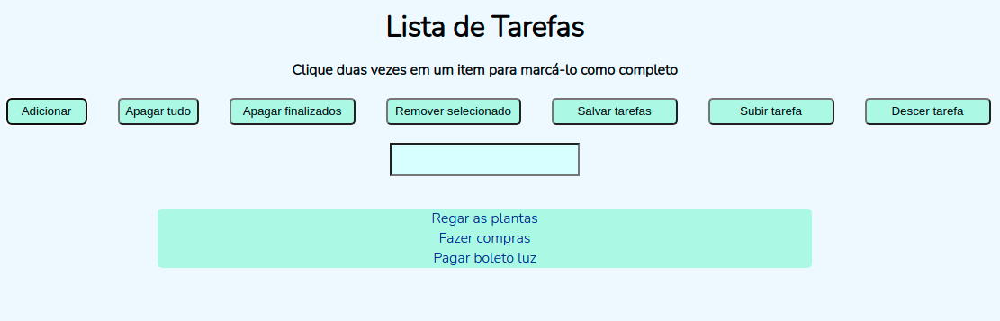

# Boas vindas ao repositório Lista de Tarefas

Visualize a página do projeto clicando <a href="https://camila-mp.github.io/lista-de-tarefas/">aqui</a>.

# Sobre

Projeto desenvolvido no curso da Trybe no módulo de Fundamentos do Desenvolvimento Web (6 semanas de curso).
A página consiste em uma lista de tarefas com várias funcionalidades, como: adicionar tarefa, riscar tarefa concluída, mudar ordem das tarefas, remover uma tarefa e salvar a lista de tarefas.

# Tecnologias utilizadas

`HTML`, `CSS` e `JavaScript`.

# Como rodar o projeto na sua máquina

Abra seu Visual Studio code e siga as instruções a seguir.

1. Clone o repositório com o comando:
`git clone git@github.com:camila-mp/lista-de-tarefas.git`

2. Entre na pasta clonada:
`cd lista-de-tarefas`

3. Instale as dependências com:
`npm install` ou `yarn`

4. Instale a extensão do VS Code Live Server;

5. Utilize o atalho `Ctrl + Shift + P` no VSCode e procure por `Live Server: Open with Live Server`.
